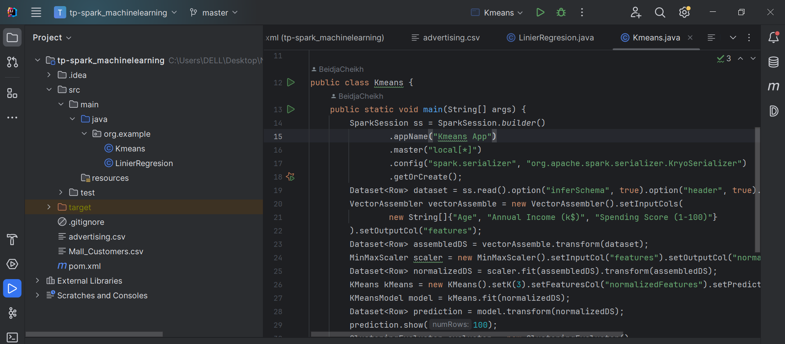
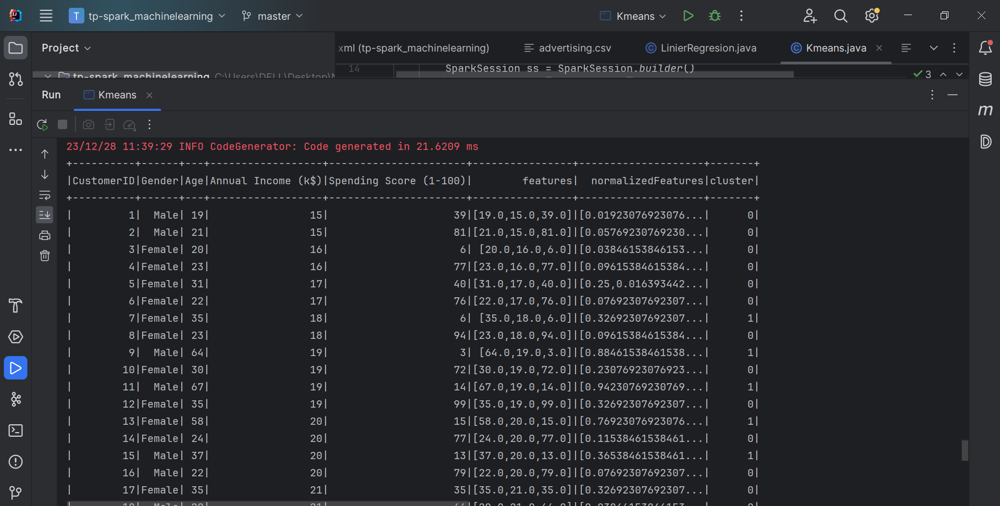
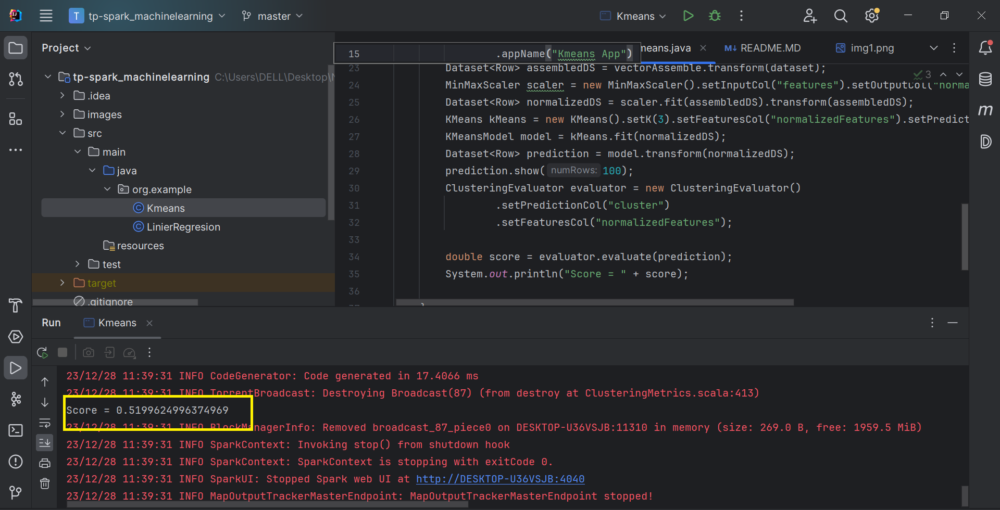

The aim of this Java code using Apache Spark MLlib is to apply the K-Means clustering algorithm to a data set of shopping
mall customers. The main steps include loading the data, assembling the features, normalizing, training the K-Means model,
making predictions and evaluating the quality of the clusters formed. The final objective is to obtain a segmentation of
customers into distinct groups based on their characteristics, such as age, annual income, and spending score.
<h2>Kmeans</h2>
  
  
<h2> Score</h2> 
  